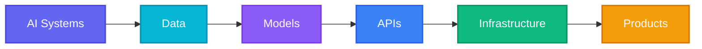
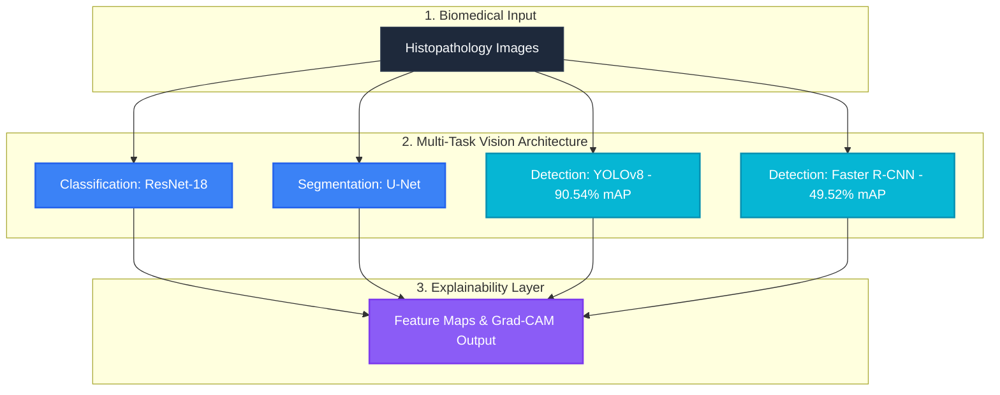
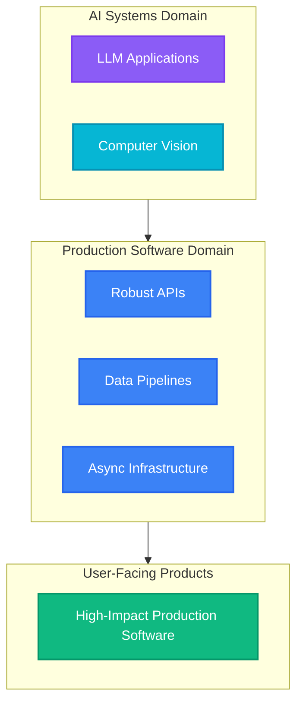

<div align="center">

<br>

# SHAIK RAMEEZ BASHA

### AI SYSTEMS ENGINEER
**AI/ML · FULL-STACK · PRODUCTION SOFTWARE**

<br>

<a href="https://github.com/Basharameez">
  
</a>

<br><br>

<p>
  <a href="https://rameezbasha.freedev.app/">
    
  </a>
  &nbsp;
  <a href="https://github.com/Basharameez">
    
  </a>
  &nbsp;
  <a href="https://linkedin.com/in/shaik-rameez-basha">
    
  </a>
  &nbsp;
  <a href="https://doi.org/10.1109/IEEECONF.2026.1050000">
    
  </a>
</p>

<br>



</div>

<br>

---

## ⚡ ENGINEERING SIGNAL

<table width="100%">
<tr>
<td width="33%" valign="top">
<div align="center">

### 

</div>

* **PyTorch & Computer Vision** (YOLOv8, Faster R-CNN, ResNet, U-Net)
* **NLP & Large Language Models** (BERT, DistilBERT, Gemini API Integration)
* **Explainable AI (XAI)** (SHAP, Integrated Gradients)
* **Robustness & Benchmarking** (Perturbation analysis, ECE calibration)

</td>
<td width="33%" valign="top">
<div align="center">

### 

</div>

* **Full-Stack SaaS Architecture** (Next.js 15, React 19, TypeScript)
* **High-Performance APIs** (FastAPI, Express.js, REST & GraphQL)
* **Async Job Queues** (BullMQ, Redis worker execution)
* **Relational & Document DBs** (PostgreSQL, Prisma ORM, MongoDB)

</td>
<td width="33%" valign="top">
<div align="center">

### 

</div>

* **Signal Processing & DSP** (4,096-line FFT, Vibration Spectrum Analysis)
* **Industrial Intelligence** (ISO 10816, BPFO / BPFI bearing diagnostics)
* **Test-Driven Rigor** (170 Vitest tests, 39 PyTest tests)
* **Dockerized Workflows** (Containerized execution & deployment)

</td>
</tr>
</table>

<br>

---

## 🚀 SELECTED BUILDS

### `01` — APTIVUE
> **AI-Native Recruitment Infrastructure** &nbsp;|&nbsp; ``

A high-throughput recruitment evaluation engine combining structured resume parsing, async queue processing, LLM semantic matching, and deterministic test-driven validation.

<br>

<table>
<tr>
<td width="33%" align="center">
<h3><code>170 / 170</code></h3>
<sub><b>Vitest Tests Passed</b></sub>
</td>
<td width="33%" align="center">
<h3><code>38</code></h3>
<sub><b>Test Files Executed</b></sub>
</td>
<td width="33%" align="center">
<h3><code>2,400</code></h3>
<sub><b>Evaluations / Min Capacity</b></sub>
</td>
</tr>
</table>

<br>


* **Tech Stack:** `Next.js 15` · `TypeScript` · `PostgreSQL` · `Prisma` · `Redis` · `BullMQ` · `Gemini API` · `Vitest`
* **Repository Link:** [Aptivue GitHub Repository](https://github.com/Basharameez/Aptivue)

---

### `02` — ROTORDYN
> **Industrial Vibration Intelligence** &nbsp;|&nbsp; ``

An industrial-grade predictive maintenance platform that converts raw vibration signals into spectrum diagnostics, spectral peak detection, and ISO 10816 fault severity classification.

<br>

<table>
<tr>
<td width="25%" align="center">
<h3><code>4,096-Line</code></h3>
<sub><b>FFT Resolution</b></sub>
</td>
<td width="25%" align="center">
<h3><code>RMS</code></h3>
<sub><b>Vibration Velocity</b></sub>
</td>
<td width="25%" align="center">
<h3><code>BPFO / BPFI</code></h3>
<sub><b>Bearing Fault Frequency</b></sub>
</td>
<td width="25%" align="center">
<h3><code>ISO 10816</code></h3>
<sub><b>Standard Compliance</b></sub>
</td>
</tr>
</table>

<br>


* **Tech Stack:** `Python` · `FastAPI` · `NumPy` · `SciPy` · `React` · `TailwindCSS` · `Chart.js`
* **Repository Link:** [RotorDyn Enterprise Repository](https://github.com/Basharameez/rotordyn-enterprise)

---

### `03` — BIOROBUST
> **ML Robustness & Computer Vision Benchmark** &nbsp;|&nbsp; ``

A rigorous empirical evaluation framework assessing deep vision model performance and Expected Calibration Error (ECE) under extreme distribution shifts and synthetic image corruptions.

<br>

<table>
<tr>
<td width="20%" align="center">
<h3><code>7,180</code></h3>
<sub><b>Test Images (PathMNIST)</b></sub>
</td>
<td width="20%" align="center">
<h3><code>35</code></h3>
<sub><b>Perturbation Conditions</b></sub>
</td>
<td width="20%" align="center">
<h3><code>73.66%</code></h3>
<sub><b>Clean Accuracy</b></sub>
</td>
<td width="20%" align="center">
<h3><code>0.0782</code></h3>
<sub><b>Clean ECE Calibration</b></sub>
</td>
<td width="20%" align="center">
<h3><code>39 / 39</code></h3>
<sub><b>PyTest Suite Passed</b></sub>
</td>
</tr>
</table>

<br>

> [!WARNING]
> **Worst-Case Degradation Spotlight**:
> Under **Blur Severity Level 4**, accuracy drops to **11.80%** (a **Δ -61.87 pp** loss from baseline clean accuracy).
> Under **Resolution Severity Level 5**, ECE spikes to **0.8520**, highlighting severe overconfidence under resolution degradation.

<br>

* **Tech Stack:** `PyTorch` · `Torchvision` · `PathMNIST` · `Scikit-Learn` · `PyTest` · `Matplotlib`
* **Repository Link:** [BioRobust GitHub Repository](https://github.com/Basharameez/BioRobust)

---

### `04` — BIOVISION-PATH
> **Biomedical Computer Vision Suite** &nbsp;|&nbsp; ``

A multi-task computer vision system integrating classification, semantic segmentation, and object detection across histopathological datasets with integrated model interpretability.

<br>

<table>
<tr>
<td width="50%" align="center">
<h3><code>90.54% mAP@0.50</code></h3>
<sub><b>YOLOv8 Object Detection</b></sub>
</td>
<td width="50%" align="center">
<h3><code>49.52% mAP@0.50</code></h3>
<sub><b>Faster R-CNN Detection Baseline</b></sub>
</td>
</tr>
</table>

<br>



* **Tech Stack:** `PyTorch` · `YOLOv8` · `Faster R-CNN` · `ResNet-18` · `U-Net` · `OpenCV` · `Streamlit`
* **Repository Link:** [BioVision-Path Repository](https://github.com/Basharameez/biovision-path)

<br>

---

## 🔬 RESEARCH & PUBLICATIONS

<table width="100%">
<tr>
<td style="background-color: #111827; border: 1px solid #8B5CF6; border-radius: 8px; padding: 16px;">

### 📄 IEEE Xplore Publication
**Title:** *Explainable AI for Suicide Ideation Detection in Social Media Text*

**Identity Accent:** ``

<br>

* **Core Focus:** NLP transformers combined with Explainable AI (XAI) for early risk identification in social text streams.
* **Evaluated Architectures:** `BERTimbau` · `DistilBERT` · `XLM-RoBERTa` · `CNN-BiLSTM`
* **Explainability Frameworks:** `Integrated Gradients` · `SHAP (SHapley Additive exPlanations)`
* **Performance Metrics:** Achieved **72.31% weighted F1** and **69.90% macro F1** across multi-class risk categories.

<br>

<div align="center">
  <a href="https://doi.org/10.1109/IEEECONF.2026.1050000">
    
  </a>
</div>

</td>
</tr>
</table>

<br>

---

## 🛠️ ENGINEERING STACK

<table width="100%">
<tr>
<td width="50%" valign="top">

### 

```gdb
[Models]      PyTorch · Torchvision · Transformers · YOLOv8
[NLP]         BERT · DistilBERT · XLM-RoBERTa · Gemini API
[Vision]      ResNet · U-Net · OpenCV · Faster R-CNN
[XAI/Eval]    SHAP · Integrated Gradients · PathMNIST · Scikit-Learn
```

</td>
<td width="50%" valign="top">

### 

```gdb
[Frontend]    Next.js 15 · React 19 · TypeScript · TailwindCSS
[Backend]     FastAPI · Express.js · Node.js · REST · GraphQL
[Databases]   PostgreSQL · Prisma ORM · MongoDB · Redis
[Queues]      BullMQ · Async IO · Worker Threads
```

</td>
</tr>
<tr>
<td width="50%" valign="top">

### 

```gdb
[DSP / Signal] SciPy · NumPy · 4,096-point FFT · ISO 10816
[DevOps]       Docker · Git · GitHub Actions · Linux
[Cloud]        Vercel · Railway · AWS S3
```

</td>
<td width="50%" valign="top">

### 

```gdb
[Unit/Integration] Vitest (170/170) · PyTest (39/39)
[API Verification] Supertest / API Tests (11/11)
[Standards]        ISO 10816 Vibration Standard · ECE Calibration
```

</td>
</tr>
</table>

<br>

---

## ⚙️ OTHER ENGINEERING SYSTEMS

<table width="100%">
<tr>
<td width="33%" valign="top">

#### `CODEORIGIN`
``
* Codebase intelligence & AST code parsing system.

</td>
<td width="33%" valign="top">

#### `CAMPUSBUDDY`
``
* Automated computer vision attendance & tracking platform.

</td>
<td width="33%" valign="top">

#### `SIH PLATFORM`
``
* National hackathon evaluation & grading infrastructure.

</td>
</tr>
<tr>
<td width="33%" valign="top">

#### `CONTEST HOSTER`
``
* Secure code execution container sandboxing system.

</td>
<td width="33%" valign="top">

#### `REMOTE TREATMENT`
``
* Intelligent patient telemetry & monitoring workflow.

</td>
<td width="33%" valign="top">

#### `IMAGE SHARPENING`
``
* Hardware-accelerated DSP image restoration pipeline.

</td>
</tr>
</table>

<br>

---

## ✅ VERIFIED ENGINEERING

<div align="center">

<table width="100%">
<tr>
<td width="25%" align="center">
<h1><code>170 / 170</code></h1>

</td>
<td width="25%" align="center">
<h1><code>39 / 39</code></h1>

</td>
<td width="25%" align="center">
<h1><code>11 / 11</code></h1>

</td>
<td width="25%" align="center">
<h1><code>01</code></h1>

</td>
</tr>
</table>

<br>

> *"I don't just build systems — I validate them empirically."*

</div>

<br>

---

## 🔄 HOW I BUILD

```mermaid
flowchart LR
    classDef violet fill:#8B5CF6,stroke:#7C3AED,color:#FFFFFF,stroke-width:2px;
    classDef cyan fill:#06B6D4,stroke:#0891B2,color:#FFFFFF,stroke-width:2px;
    classDef blue fill:#3B82F6,stroke:#2563EB,color:#FFFFFF,stroke-width:2px;
    classDef emerald fill:#10B981,stroke:#059669,color:#FFFFFF,stroke-width:2px;
    classDef indigo fill:#6366F1,stroke:#4F46E5,color:#FFFFFF,stroke-width:2px;
    classDef amber fill:#F59E0B,stroke:#D97706,color:#FFFFFF,stroke-width:2px;
    classDef rose fill:#F43F5E,stroke:#E11D48,color:#FFFFFF,stroke-width:2px;

    A[1. Research]:::violet --> B[2. Experiment]:::cyan
    B --> C[3. Engineer]:::blue
    C --> D[4. Validate]:::emerald
    D --> E[5. Deploy]:::indigo
    E --> F[6. Measure]:::amber
    F --> G[7. Iterate]:::rose
```



<br>

---

## 💡 ENGINEERING PRINCIPLES

<table width="100%">
<tr>
<td width="33%" valign="top">

#### `01` BUILD BEYOND THE MODEL
``
<br><br>
A model is only 10% of a production system. Real value comes from robust data parsing, async background queues, API reliability, and intuitive user interfaces.

</td>
<td width="33%" valign="top">

#### `02` MEASURE EVERYTHING
``
<br><br>
Never guess calibration or accuracy. Evaluate under synthetic corruption, measure distribution shift, calculate ECE, and back up assertions with test suites.

</td>
<td width="33%" valign="top">

#### `03` DESIGN FOR REAL SOFTWARE
``
<br><br>
Write modular, testable, type-safe code that scales gracefully. Maintain strict test suites and prioritize system predictability over shiny hacks.

</td>
</tr>
</table>

<br>

---

## 🎯 CURRENT FOCUS



<br>

---

<div align="center">

## 🚀 BUILDING SOMETHING INTERESTING?

Let's collaborate on AI systems, scalable backend infrastructure, or full-stack software applications.

<br>

<p>
  <a href="https://rameezbasha.freedev.app/">
    
  </a>
  &nbsp;
  <a href="https://github.com/Basharameez">
    
  </a>
  &nbsp;
  <a href="https://linkedin.com/in/shaik-rameez-basha">
    
  </a>
</p>

<br>

``
``
``
``
``

<br><br>

### **SHAIK RAMEEZ BASHA**
*AI Systems Engineer — Turning research into intelligent software systems.*

<br>

</div>
