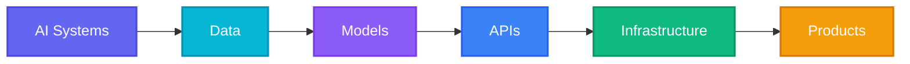
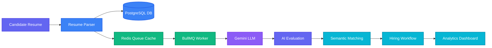
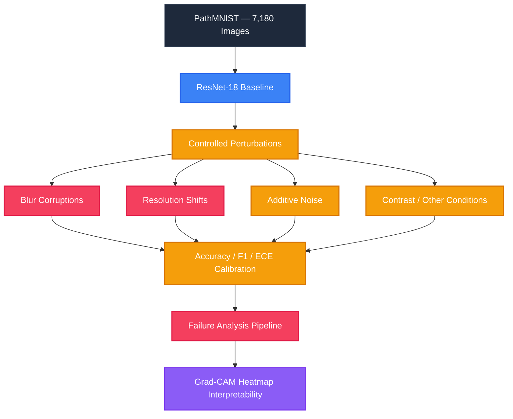
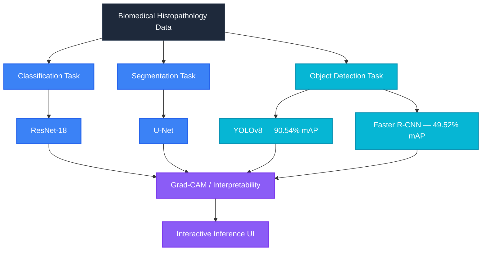
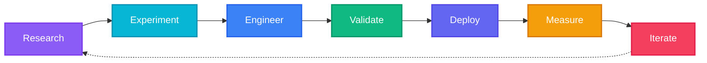
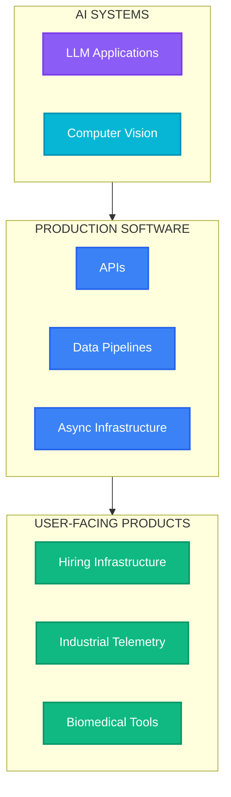

<a name="home"></a>

<div align="center">

<br>

# SHAIK RAMEEZ BASHA

### AI SYSTEMS ENGINEER
**AI/ML · FULL-STACK · PRODUCTION SOFTWARE**

<br>

<a href="https://github.com/Basharameez">
  
</a>

<br><br>

<p>
  <a href="https://rameezbasha.freedev.app/">
    
  </a>
  &nbsp;
  <a href="https://github.com/Basharameez">
    
  </a>
  &nbsp;
  <a href="https://www.linkedin.com/in/shaik-rameez-basha-151740286/">
    
  </a>
  &nbsp;
  <a href="https://doi.org/10.1109/IDICAIHEI65991.2025.11377560">
    
  </a>
</p>

<br>

> *I build intelligent software systems — from models and data pipelines to APIs, interfaces, infrastructure, and production workflows.*

<br>

<!-- FLOATING MOBILE BOTTOM NAVIGATION DOCK CONCEPT -->
<table style="background-color: #111827; border: 1px solid #374151; border-radius: 20px; padding: 6px 12px;">
<tr>
<td align="center">
  <a href="#home">
    
  </a>
</td>
<td align="center">
  <a href="#selected-builds">
    
  </a>
</td>
<td align="center">
  <a href="#research">
    
  </a>
</td>
<td align="center">
  <a href="#engineering-stack">
    
  </a>
</td>
<td align="center">
  <a href="#verified-engineering">
    
  </a>
</td>
<td align="center">
  <a href="#connect">
    
  </a>
</td>
</tr>
</table>

<br>



</div>

<br>

---

## HOME — AI ENGINEERING SYSTEM

<div align="center">

### FEATURED SYSTEMS TILES

<table width="100%">
<tr>
<td width="25%" align="center">
<a href="#01--aptivue">
<br>
<sub><b>AI Recruitment OS</b></sub>
</a>
</td>
<td width="25%" align="center">
<a href="#02--rotordyn">
<br>
<sub><b>Industrial AI Telemetry</b></sub>
</a>
</td>
<td width="25%" align="center">
<a href="#03--biorobust">
<br>
<sub><b>ML Robustness Benchmark</b></sub>
</a>
</td>
<td width="25%" align="center">
<a href="#04--biovision-path">
<br>
<sub><b>Biomedical Vision Pipeline</b></sub>
</a>
</td>
</tr>
</table>

</div>

<br>

<table width="100%">
<tr>
<td width="33%" valign="top">
<div align="center">

### 

</div>

* PyTorch & Computer Vision
* NLP & LLM Applications
* Explainable AI (SHAP, Integrated Gradients)
* ML Robustness & ECE Calibration

</td>
<td width="33%" valign="top">
<div align="center">

### 

</div>

* Full-Stack SaaS (Next.js 15, React 19, TypeScript)
* Python, FastAPI, Express.js & Node.js
* Async Queues (BullMQ, Redis Workers)
* PostgreSQL, Drizzle ORM, Supabase, MongoDB

</td>
<td width="33%" valign="top">
<div align="center">

### 

</div>

* Signal Processing (4,096-line FFT, Vibration Spectrum)
* Industrial Intelligence (ISO 10816, BPFO / BPFI)
* Test-Driven Rigor (170 Vitest, 39 PyTest)
* Docker & Containerized Workflows

</td>
</tr>
</table>

<br>

<div align="center">
<table width="100%">
<tr>
<td width="25%" align="center">
<h3><code>170 / 170</code></h3>
<sub><b>Vitest Tests Passed</b></sub>
</td>
<td width="25%" align="center">
<h3><code>39 / 39</code></h3>
<sub><b>PyTest Suite Passed</b></sub>
</td>
<td width="25%" align="center">
<h3><code>11 / 11</code></h3>
<sub><b>API Verification Tests</b></sub>
</td>
<td width="25%" align="center">
<h3><code>01</code></h3>
<sub><b>IEEE Publication</b></sub>
</td>
</tr>
</table>
</div>

<p align="right">
<a href="#home">↑ HOME DOCK</a>
</p>

---

<a name="selected-builds"></a>

## 02 — SELECTED BUILDS

<a name="01--aptivue"></a>

### `01` — APTIVUE
> **AI-NATIVE RECRUITMENT INFRASTRUCTURE** &nbsp;|&nbsp; 

Aptivue (AptiHire AI / TalentOS) is an AI-powered recruitment evaluation platform designed around resume intelligence, candidate evaluation, semantic matching, hiring workflows, and analytics.

<br>

<table>
<tr>
<td width="33%" align="center">
<h3><code>170 / 170</code></h3>
<sub><b>Vitest Tests Passed</b></sub>
</td>
<td width="33%" align="center">
<h3><code>38</code></h3>
<sub><b>Test Files Executed</b></sub>
</td>
<td width="33%" align="center">
<h3><code>2,400</code></h3>
<sub><b>Evaluations / Min Capacity</b></sub>
</td>
</tr>
</table>

<br>



* **Tech Stack:** `Next.js 15` · `React` · `TypeScript` · `Gemini` · `PostgreSQL` · `Supabase` · `Drizzle ORM` · `Redis` · `BullMQ` · `Vitest`
* **Repository Link:** [AptiHire-AI GitHub Repository](https://github.com/2049basharam/AptiHire-AI)

---

<a name="02--rotordyn"></a>

### `02` — ROTORDYN
> **INDUSTRIAL VIBRATION INTELLIGENCE** &nbsp;|&nbsp; 

A production-oriented SaaS platform for analyzing machine vibration telemetry and transforming raw sensor data into actionable bearing diagnostics, spectral peak detection, and ISO 10816 fault severity classification.

<br>

<table>
<tr>
<td width="25%" align="center">
<h3><code>4,096-Line</code></h3>
<sub><b>FFT Resolution</b></sub>
</td>
<td width="25%" align="center">
<h3><code>RMS</code></h3>
<sub><b>Vibration Velocity</b></sub>
</td>
<td width="25%" align="center">
<h3><code>BPFO / BPFI</code></h3>
<sub><b>Defect Detection</b></sub>
</td>
<td width="25%" align="center">
<h3><code>ISO 10816</code></h3>
<sub><b>Standard Compliance</b></sub>
</td>
</tr>
</table>

<br>



```mermaid
flowchart LR
    classDef cyan fill:#06B6D4,stroke:#0891B2,color:#FFFFFF,stroke-width:2px;
    classDef emerald fill:#10B981,stroke:#059669,color:#FFFFFF,stroke-width:2px;
    classDef blue fill:#3B82F6,stroke:#2563EB,color:#FFFFFF,stroke-width:2px;
    classDef dark fill:#1E293B,stroke:#334155,color:#F8FAFC,stroke-width:1px;

    A[CSV / Excel / Sensor Data]:::dark --> B[FastAPI Ingestion]:::blue
    B --> C[Signal Preprocessing]:::cyan
    C --> D[4096-Line FFT Analysis]:::cyan
    D --> E[BPFO / BPFI Detection]:::emerald
    E --> F[RMS + ISO 10816 Severity]:::emerald
    F --> G[Diagnostic Report Dashboard]:::dark
```

* **Tech Stack:** `Python` · `FastAPI` · `React` · `PostgreSQL` · `Pandas` · `Plotly.js` · `FFT` · `ISO 10816`
* **Capabilities:** CSV / Excel ingestion · Signal preprocessing · 4,096-line FFT · RMS velocity · BPFO/BPFI defect frequency · Machine-health severity classification · Interactive visualization · AI-assisted reporting
* **Repository Link:** [RotorDyn Enterprise Repository](https://github.com/Basharameez/rotordyn-enterprise)

---

<a name="03--biorobust"></a>

### `03` — BIOROBUST
> **ML ROBUSTNESS & COMPUTER VISION** &nbsp;|&nbsp; 

A benchmarking framework for evaluating computer vision model behavior under controlled image degradation, distribution shifts, and Expected Calibration Error (ECE) analysis.

<br>

<table>
<tr>
<td width="20%" align="center">
<h3><code>7,180</code></h3>
<sub><b>Test Images (PathMNIST)</b></sub>
</td>
<td width="20%" align="center">
<h3><code>35</code></h3>
<sub><b>Perturbation Conditions</b></sub>
</td>
<td width="20%" align="center">
<h3><code>73.66%</code></h3>
<sub><b>Clean Accuracy</b></sub>
</td>
<td width="20%" align="center">
<h3><code>0.0782</code></h3>
<sub><b>Clean ECE Calibration</b></sub>
</td>
<td width="20%" align="center">
<h3><code>39 / 39</code></h3>
<sub><b>PyTest Passed</b></sub>
</td>
</tr>
</table>

<br>



<br>

> [!WARNING]
> **Worst-Case Degradation Spotlight**:
> Under **Blur Severity Level 4**, accuracy drops to **11.80%** (a **Δ -61.87 pp** loss from clean baseline).
> Under **Resolution Severity Level 5**, ECE spikes to **0.8520**, highlighting severe overconfidence under resolution degradation.

<br>

* **Tech Stack:** `PyTorch` · `Torchvision` · `PathMNIST` · `Scikit-Learn` · `PyTest` · `Matplotlib`
* **Repository Link:** [BioVision-Path GitHub Repository](https://github.com/Basharameez/BioVision-Path)
* **Hugging Face Demo:** [BioVision-Path Space](https://huggingface.co/spaces/BASHARAMEEZ/BioVision-Path)

---

<a name="04--biovision-path"></a>

### `04` — BIOVISION-PATH
> **BIOMEDICAL COMPUTER VISION PIPELINE** &nbsp;|&nbsp; 

A multi-task biomedical computer vision pipeline covering classification, semantic segmentation, object detection, interpretability, and interactive inference.

<br>

<table>
<tr>
<td width="50%" align="center">
<h3><code>90.54% mAP@0.50</code></h3>
<sub><b>YOLOv8 Object Detection</b></sub>
</td>
<td width="50%" align="center">
<h3><code>49.52% mAP@0.50</code></h3>
<sub><b>Faster R-CNN Detection Baseline</b></sub>
</td>
</tr>
</table>

<br>



* **Tech Stack:** `Python` · `PyTorch` · `YOLOv8` · `U-Net` · `Faster R-CNN` · `OpenCV` · `Grad-CAM` · `Gradio`
* **Repository Link:** [BioVision-Path Repository](https://github.com/Basharameez/biovision-path)

<p align="right">
<a href="#home">↑ HOME DOCK</a>
</p>

---

<a name="research"></a>

## 03 — RESEARCH

<table width="100%">
<tr>
<td style="background-color: #111827; border: 1px solid #8B5CF6; border-radius: 8px; padding: 16px;">

### IEEE Xplore Publication
**Title:** *Explainable AI for Suicide Ideation Detection in Social Media Text*

**Identity Accent:** 

<br>

* **Core Focus:** Research exploring explainable NLP approaches using deep learning architectures and feature attribution methods for early risk identification in social text streams.
* **Evaluated Architectures:** `BERTimbau` · `DistilBERT` · `XLM-RoBERTa` · `CNN-BiLSTM`
* **Explainability Frameworks:** `Integrated Gradients` · `SHAP (SHapley Additive exPlanations)`
* **Performance Metrics:** Achieved **72.31% weighted F1** and **69.90% macro F1** across multi-class risk categories.

<br>

<div align="center">
  <a href="https://doi.org/10.1109/IDICAIHEI65991.2025.11377560">
    
  </a>
</div>

</td>
</tr>
</table>

<p align="right">
<a href="#home">↑ HOME DOCK</a>
</p>

---

<a name="engineering-stack"></a>

## 04 — ENGINEERING STACK

<table width="100%">
<tr>
<td width="50%" valign="top">

### 

```gdb
[Models]      Python · PyTorch · OpenCV · Gemini API
[NLP / Vision] BERT · DistilBERT · XLM-RoBERTa · YOLOv8 · U-Net
[XAI & Eval]  SHAP · Integrated Gradients · PathMNIST · Scikit-Learn
```

</td>
<td width="50%" valign="top">

### 

```gdb
[Frontend]    TypeScript · JavaScript · React 19 · Next.js 15
[Backend]     FastAPI · Express.js · Node.js · REST APIs
[Databases]   PostgreSQL · Prisma ORM · Drizzle ORM · Supabase · MongoDB
```

</td>
</tr>
<tr>
<td width="50%" valign="top">

### 

```gdb
[Infrastructure] PostgreSQL · Redis · BullMQ Queue · Docker
[DevOps / Cloud] Git · Linux · Vercel · Railway · AWS S3
[Signal Processing] SciPy · NumPy · 4,096-point FFT · ISO 10816
```

</td>
<td width="50%" valign="top">

### 

```gdb
[Unit / Integration] Vitest (170/170) · PyTest (39/39)
[API Verification]   Supertest / API Verification Tests (11/11)
[Validation Standards] ISO 10816 Vibration Standard · ECE Calibration
```

</td>
</tr>
</table>

<p align="right">
<a href="#home">↑ HOME DOCK</a>
</p>

---

## 05 — OTHER SYSTEMS

<table width="100%">
<tr>
<td width="33%" valign="top">

#### `CODEORIGIN`

* Codebase intelligence & AST code parsing system.

</td>
<td width="33%" valign="top">

#### `CAMPUSBUDDY`

* Automated computer vision attendance & tracking platform.

</td>
<td width="33%" valign="top">

#### `SIH PLATFORM`

* National hackathon evaluation & grading infrastructure.

</td>
</tr>
<tr>
<td width="33%" valign="top">

#### `CONTEST HOSTER`

* Secure code execution container sandboxing system.

</td>
<td width="33%" valign="top">

#### `REMOTE TREATMENT`

* Intelligent patient telemetry & monitoring workflow.

</td>
<td width="33%" valign="top">

#### `IMAGE SHARPENING`

* Hardware-accelerated DSP image restoration pipeline.

</td>
</tr>
</table>

<br>

---

<a name="verified-engineering"></a>

## 06 — VERIFIED ENGINEERING

<div align="center">

<table width="100%">
<tr>
<td width="25%" align="center">
<h1><code>170 / 170</code></h1>
<br>
<sub><b>38 Test Files Executed</b></sub>
</td>
<td width="25%" align="center">
<h1><code>39 / 39</code></h1>
<br>
<sub><b>BioRobust Benchmark</b></sub>
</td>
<td width="25%" align="center">
<h1><code>11 / 11</code></h1>
<br>
<sub><b>SIH Platform Suite</b></sub>
</td>
<td width="25%" align="center">
<h1><code>01</code></h1>
<br>
<sub><b>Published Research</b></sub>
</td>
</tr>
</table>

<br>

> **I don't just build systems. I validate them.**

</div>

<p align="right">
<a href="#home">↑ HOME DOCK</a>
</p>

---

## 07 — HOW I BUILD



<br>

> *I focus on the engineering layer between AI research and usable software.*
> 
> **Models → Data → APIs → Backend → Infrastructure → Interfaces → Testing → Production**

<br>

---

## 08 — ENGINEERING PRINCIPLES

<table width="100%">
<tr>
<td width="33%" valign="top">

#### `01` BUILD BEYOND THE MODEL

<br><br>
A model is only one component of an AI product. Data, APIs, queues, databases, interfaces, and infrastructure determine whether it becomes useful software.

</td>
<td width="33%" valign="top">

#### `02` MEASURE EVERYTHING

<br><br>
Accuracy. F1. Calibration. Throughput. Latency. Failure modes. Testing. Evaluate under corruption, measure distribution shift, and back up assertions with test suites.

</td>
<td width="33%" valign="top">

#### `03` DESIGN FOR REAL SOFTWARE

<br><br>
AI capabilities should become reliable systems people can actually use. Write modular, testable, type-safe code that scales gracefully.

</td>
</tr>
</table>

<br>

---

## CURRENT FOCUS



<br>

---

<a name="connect"></a>

<div align="center">

## 09 — CONNECT

### BUILDING SOMETHING INTERESTING?

Let's collaborate on AI systems, scalable backend infrastructure, or full-stack software applications.

<br>

<p>
  <a href="https://rameezbasha.freedev.app/">
    
  </a>
  &nbsp;
  <a href="https://github.com/Basharameez">
    
  </a>
  &nbsp;
  <a href="https://www.linkedin.com/in/shaik-rameez-basha-151740286/">
    
  </a>
  &nbsp;
  <a href="mailto:shaikbashah20@gmail.com">
    
  </a>
</p>

<br>

<p>
  
  &nbsp;
  
  &nbsp;
  
  &nbsp;
  
  &nbsp;
  
</p>

<br><br>

### **SHAIK RAMEEZ BASHA**
*AI Systems Engineer — Turning research into intelligent software systems.*

<br>

<p align="right">
<a href="#home">↑ HOME DOCK</a>
</p>

</div>
