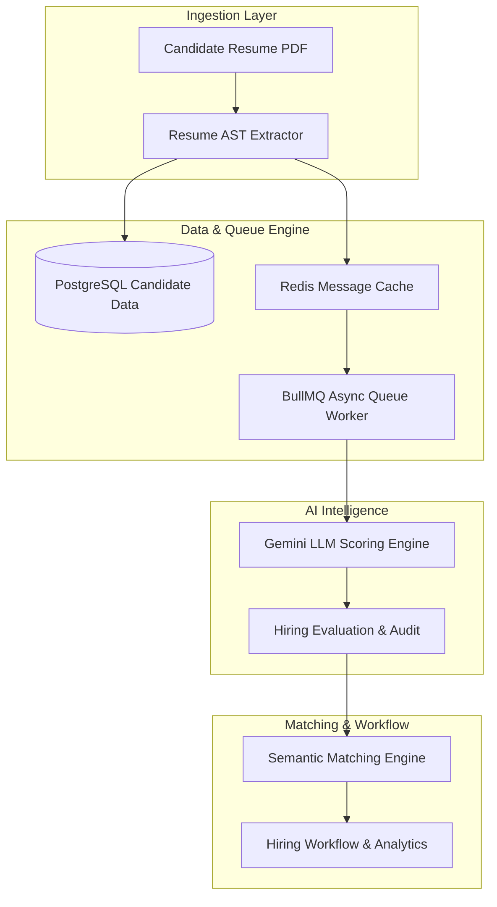
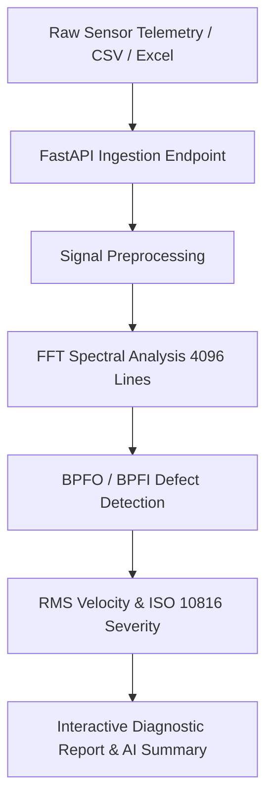
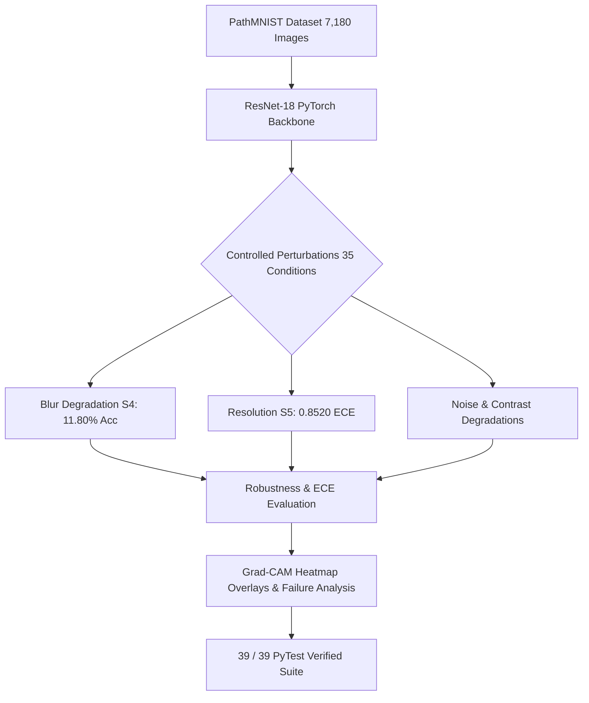
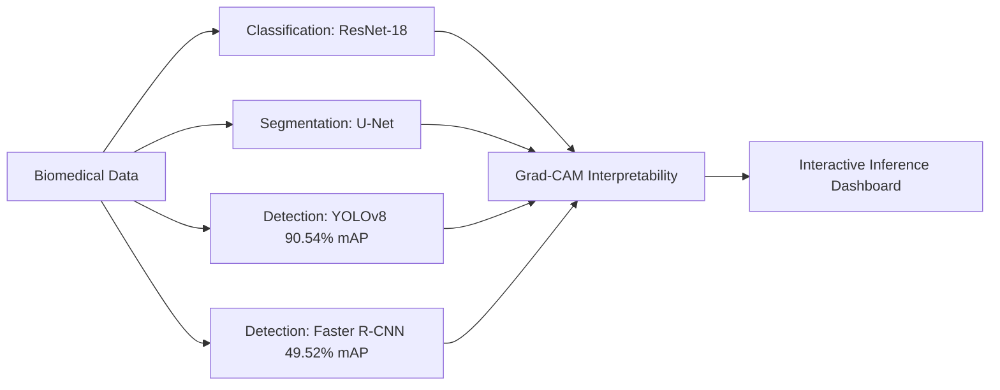
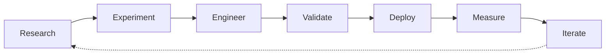
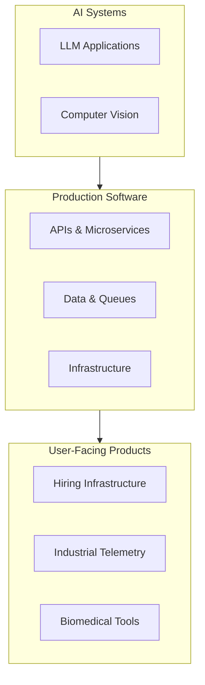

 

# SHAIK RAMEEZ BASHA

### AI SYSTEMS ENGINEER
**AI/ML · FULL-STACK · PRODUCTION SOFTWARE**

 

  

  
  
  
  

 

> **I build intelligent software systems — from models and data pipelines to APIs, interfaces, infrastructure, and production workflows.**

 

---

## ENGINEERING SIGNAL

<table>
<tr>
<td align="center" width="33%">

### AI / ML

PyTorch  
Computer Vision  
NLP  
LLM Applications  
Explainable AI  
Model Evaluation

</td>

<td align="center" width="33%">

### SOFTWARE

Python  
TypeScript  
Next.js  
React  
FastAPI  
Node.js

</td>

<td align="center" width="33%">

### SYSTEMS

PostgreSQL  
Redis  
BullMQ  
Docker  
REST APIs  
Testing & CI

</td>
</tr>
</table>

---

# SELECTED BUILDS

## 01 — APTIVUE

### AI-NATIVE RECRUITMENT INFRASTRUCTURE

**Aptivue** (AptiHire AI / TalentOS) is an AI-powered recruitment platform designed around resume intelligence, candidate evaluation, semantic matching, hiring workflows, and analytics.

### Engineering

`Next.js 15` · `React` · `TypeScript` · `Gemini` · `PostgreSQL` · `Supabase` · `Drizzle ORM` · `Redis` · `BullMQ` · `Vitest`

### Verified Evidence

| Signal | Result |
| :--- | ---: |
| Vitest tests | **170 / 170 passed** |
| Test files | **38** |
| Evaluation throughput | **2,400 / min** |
| Architecture | **Async queue-based processing** |

**Repository**  
[github.com/2049basharam/AptiHire-AI](https://github.com/2049basharam/AptiHire-AI)

---

## 02 — ROTORDYN

### INDUSTRIAL VIBRATION INTELLIGENCE

A production-oriented SaaS system for analyzing machine vibration telemetry and transforming raw sensor data into actionable bearing diagnostics.

### Engineering

`Python` · `FastAPI` · `React` · `PostgreSQL` · `Pandas` · `Plotly.js` · `FFT` · `ISO 10816`

### Capabilities

* CSV / Excel telemetry ingestion
* Signal preprocessing & Fourier transform
* FFT spectral analysis (4,096 lines)
* RMS vibration velocity calculation
* Bearing defect frequency detection (BPFO / BPFI)
* Machine-health severity classification
* Interactive diagnostic visualization
* AI-assisted report generation

---

## 03 — BIOROBUST

### ML ROBUSTNESS & COMPUTER VISION

A benchmarking framework for evaluating how computer vision models behave under controlled synthetic image degradation and noise perturbations.

### Benchmark Evidence

| Metric | Result |
| :--- | ---: |
| Test images | **7,180** |
| Perturbations | **35 conditions** |
| Clean accuracy | **73.66%** |
| Weighted F1 | **72.31%** |
| Macro F1 | **69.90%** |
| Clean ECE | **0.0782** |
| PyTest | **39 / 39 passed** |

### Worst-Case Observation

**Blur S4 → 11.80% accuracy**  
*A **61.87 percentage-point degradation** from the clean baseline.*

### Calibration Error

**Resolution degradation S5 → ECE 0.8520**

### Stack

`PyTorch` · `ResNet-18` · `OpenCV` · `Grad-CAM` · `ECE Calibration` · `PyTest`

**Repository**  
[github.com/Basharameez/BioVision-Path](https://github.com/Basharameez/BioVision-Path)

**Hugging Face Space**  
[BioVision-Path](https://huggingface.co/spaces/BASHARAMEEZ/BioVision-Path)

---

## 04 — BIOVISION-PATH

### BIOMEDICAL COMPUTER VISION PIPELINE

A multi-model biomedical computer vision pipeline covering pathology classification, cellular segmentation, object detection, interpretability, and interactive inference.

### Detection Benchmark

* **YOLOv8 Standard Detector**: **90.54% mAP@0.50**
* **Faster R-CNN Baseline**: **49.52% mAP@0.50**

### Stack

`Python` · `PyTorch` · `YOLOv8` · `U-Net` · `Faster R-CNN` · `OpenCV` · `Grad-CAM` · `Gradio`

---

# RESEARCH

## EXPLAINABLE AI FOR SUICIDE IDEATION DETECTION

**IEEE Xplore Publication**

Research exploring explainable NLP approaches for suicide ideation detection in social media text using deep learning architectures and feature attribution methods.

### Methods

`BERTimbau` · `DistilBERT` · `XLM-R` · `CNN-BiLSTM` · `Integrated Gradients` · `SHAP`

**DOI Link**  
[10.1109/IDICAIHEI65991.2025.11377560](https://doi.org/10.1109/IDICAIHEI65991.2025.11377560)

---

# ENGINEERING STACK

### AI / MACHINE LEARNING

 

`Gemini API` · `NLP` · `Computer Vision` · `Explainable AI` · `Model Evaluation`

  

### SOFTWARE ENGINEERING

 

`REST APIs` · `Async Processing` · `WebSockets` · `Full-Stack Architecture`

  

### DATA & INFRASTRUCTURE

 

`PostgreSQL` · `Redis` · `BullMQ` · `Docker` · `Supabase` · `Linux`

  

### TESTING & QUALITY

`Vitest` · `PyTest` · `Unit Testing` · `Integration Testing` · `API Testing`

---

# OTHER ENGINEERING SYSTEMS

<table>
<tr>
<td width="50%" valign="top">

### CODEORIGIN

**Codebase Intelligence**

Python AST analysis, CycloneDX SBOM generation, dependency intelligence, and MinHash similarity analysis.

`Python` `AST` `CycloneDX` `MinHash`

</td>

<td width="50%" valign="top">

### CAMPUSBUDDY

**Campus Intelligence**

Campus service platform incorporating face detection and recognition through ONNX Runtime.

`YuNet` `SFace` `ONNX Runtime`

</td>
</tr>

<tr>
<td width="50%" valign="top">

### SIH NATIONAL PLATFORM

**Evaluation Infrastructure**

FastAPI-based evaluation platform with role-based workflows, state machines, and export engines.

**11 / 11 API tests passed**

</td>

<td width="50%" valign="top">

### CONTEST HOSTER

**Code Execution Infrastructure**

Competitive programming platform using isolated Docker execution environments.

`Docker` `Python` `Sandboxing`

</td>
</tr>

<tr>
<td width="50%" valign="top">

### REMOTE TREATMENT MONITORING

**Clinical Workflow Infrastructure**

Asynchronous clinician-support workflow layer with computer vision interpretability.

`PyTorch` `Grad-CAM` `FastAPI`

</td>

<td width="50%" valign="top">

### IMAGE SHARPENING SYSTEM

**Digital Signal Processing**

Image enhancement pipeline based on Laplacian and high-pass spatial filtering.

`Python` `OpenCV` `DSP`

</td>
</tr>
</table>

---

# VERIFIED ENGINEERING

<table>
<tr>
<td align="center" width="25%">

### 170 / 170

**VITEST**

38 test files

</td>

<td align="center" width="25%">

### 39 / 39

**PYTEST**

BioRobust

</td>

<td align="center" width="25%">

### 11 / 11

**API TESTS**

SIH Platform

</td>

<td align="center" width="25%">

### 01

**IEEE PAPER**

Published Research

</td>
</tr>
</table>

---

# HOW I BUILD

> **I focus on the engineering layer between AI research and usable software:**  
> **Models → Data → APIs → Backend → Infrastructure → Interfaces → Testing → Production**

---

# ENGINEERING PRINCIPLES

### 01 — BUILD BEYOND THE MODEL
A model is only one component of an AI product. The surrounding data, APIs, queues, databases, interfaces, and infrastructure determine whether it becomes useful software.

### 02 — MEASURE EVERYTHING
Accuracy. F1. Calibration. Throughput. Latency. Failure modes. Test suites.

### 03 — DESIGN FOR REAL SOFTWARE
AI capabilities should become reliable systems people can actually use.

---

# CURRENT FOCUS

---

## BUILDING SOMETHING INTERESTING?

### EXPLORE MY WORK

 

  

  

`AI/ML` · `FULL-STACK` · `SYSTEM DESIGN` · `COMPUTER VISION` · `LLMs`

  

**SHAIK RAMEEZ BASHA**

AI SYSTEMS ENGINEER · SOFTWARE BUILDER · RESEARCHER

*Turning research into intelligent software systems.*

